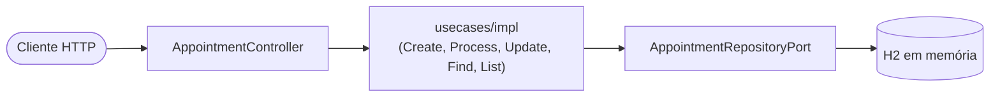
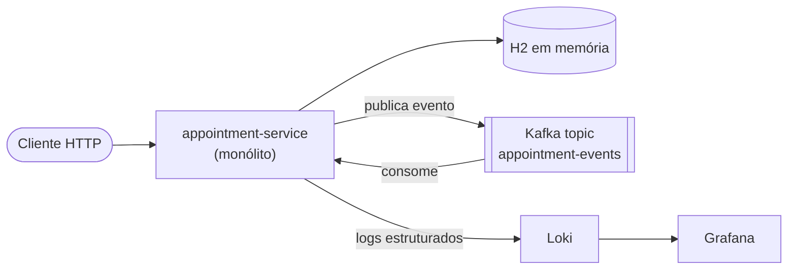
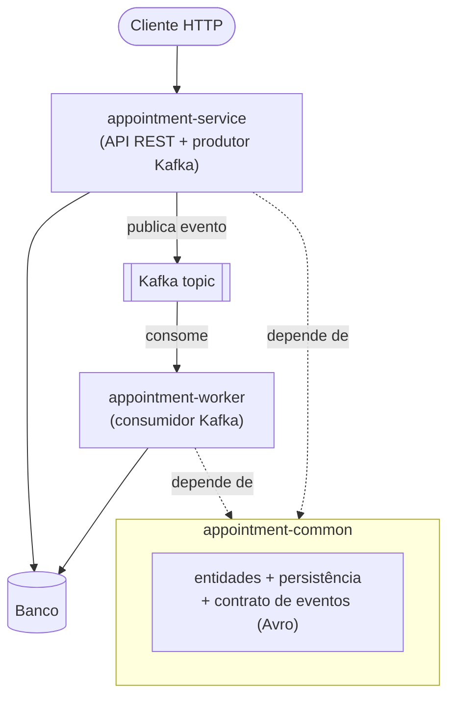
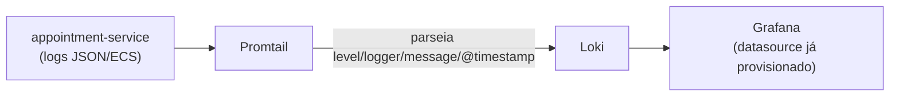

# Full-Stack Test — Agendamento de Consultas

Este projeto está estruturado em dois módulos de alto nível:

```
.
├── backend/    <- API de agendamentos, Spring Boot
└── frontend/   <- cadastro Verity em 3 etapas, React + TypeScript + Vite (implementado)
```

## Backend

O backend não vive numa branch só — ele é apresentado como uma **evolução em três etapas**, cada uma na
sua própria branch, partindo da solução mais simples possível e indo até uma versão pensada pra escalar de
verdade. A ideia é que cada branch seja um passo lógico a partir da anterior, resolvendo um problema
concreto que a etapa de trás deixou em aberto.

| Etapa | Branch | Resumo |
|---|---|---|
| 1 | `feat/simple-resolution` | Monólito simples, síncrono, H2 local |
| 2 | `main` | Mesmo domínio + Kafka, HATEOAS, idempotência e observabilidade |
| 3 | `feat/multi-module` | Quebra em módulos deployáveis independentes (API vs. worker) |

Em todas as três, as instruções de "como rodar" ficam em `backend/appointment-service/README.md` — dentro
de cada branch, porque os pré-requisitos mudam (a etapa 1 não precisa de nada além de Java; a 2 e a 3
precisam de Docker pra subir Kafka).

---

### Etapa 1 — `feat/simple-resolution`

A versão mais direta possível: um único serviço Spring Boot, arquitetura hexagonal, banco H2 em memória,
sem nenhuma infraestrutura externa. Cria, lista, busca e atualiza status de agendamentos, com as regras de
negócio (nome mínimo, CPF em formato válido, data não pode ser no passado, não é possível alterar um
agendamento cancelado, cancelar exige observação, não é possível ter dois agendamentos ativos no mesmo
horário) todas resolvidas de forma síncrona dentro da própria requisição HTTP.



Mesmo nessa versão simples, o pool de conexões do banco (HikariCP) já vem configurado explicitamente
(`AppointmentHikariPool`, `maximum-pool-size: 10`, `minimum-idle: 5`, timeouts de conexão/idle/lifetime e
`leak-detection-threshold`) em vez de deixar tudo no valor padrão — evita que o serviço abra conexões sem
limite sob carga e ajuda a detectar conexão vazando (não devolvida ao pool). Essa configuração se mantém
nas três etapas.

**Onde isso aperta ao tentar escalar:**

- Tudo roda numa única thread da requisição: criar, validar conflito de horário e "confirmar" o
  agendamento acontecem antes de responder ao cliente. Qualquer lentidão numa dessas etapas vira latência
  direta pra quem chamou a API.
- H2 em memória é por processo — não dá pra rodar duas instâncias da aplicação atrás de um load balancer,
  porque cada uma teria seu próprio banco, sem dado nenhum compartilhado entre elas.
- A checagem de horário duplicado depende de uma constraint única no banco local; funciona bem com um banco
  só, mas não resolve o problema de coordenação se o serviço crescer pra múltiplas instâncias com bancos
  separados.
- Não existe nenhum mecanismo de retry/fila para lidar com falhas transitórias, nem visibilidade
  operacional (logs estruturados, métricas, tracing) — problemas comuns quando o serviço passa a rodar em
  produção com tráfego de verdade.

Esses pontos são exatamente o que a etapa 2 ataca.

---

### Etapa 2 — `main`

Mesmo domínio da etapa 1, mesma arquitetura hexagonal por baixo, mas evoluída para separar o que precisa
ser síncrono (criar o registro) do que não precisa (confirmar o agendamento). A criação passa a publicar um
evento num tópico Kafka em vez de confirmar tudo na hora; um consumidor (dentro da própria aplicação, nesta
etapa) escuta esse tópico e processa a confirmação de forma assíncrona.



**O que foi adicionado e por quê:**

- **Kafka (produtor + consumidor, Avro + Schema Registry)** — desacopla a confirmação do agendamento da
  requisição HTTP de criação. A API responde assim que persiste o registro; a confirmação roda depois, fora
  do caminho crítico da requisição. Também prepara terreno pra etapa 3, onde produtor e consumidor viram
  processos separados.
- **Idempotência via header (`Idempotency-Key`)** — sem isso, um retry de rede no cliente (comum quando a
  chamada é assíncrona por trás dos panos) criaria um agendamento duplicado. Com o header, reenviar a mesma
  chave devolve o registro já existente.
- **Resilience4j (circuit breaker no produtor Kafka)** — o `AppointmentEventProducerImpl` roda atrás de um
  `@CircuitBreaker` (janela de 10 chamadas, abre com 50% de falha, fica 5s aberto antes de testar de novo em
  half-open). Se o Kafka cair ou ficar lento, o circuito abre e a aplicação falha rápido (`503`) em vez de
  travar threads esperando o broker responder — sem isso, uma indisponibilidade do Kafka se propagaria como
  lentidão na criação de agendamentos.
- **HATEOAS** — as respostas passam a trazer links (`self`, `confirm`, `cancel`, etc.) de acordo com o
  estado atual do agendamento, deixando explícito quais transições são válidas a partir dali, sem o cliente
  precisar hardcodar essa lógica.
- **Observabilidade (logs estruturados em formato ECS + Loki + Promtail + Grafana)** — dá visibilidade
  operacional que a etapa 1 não tinha: dá pra investigar um agendamento específico, olhar taxa de erro, etc.

Isso resolve o problema de latência/acoplamento síncrono da etapa 1, mas o produtor e o consumidor Kafka
ainda vivem no mesmo processo — se o tráfego de criação de agendamentos crescer muito mais que o de
confirmação (ou vice-versa), não dá pra escalar um sem escalar o outro. É o problema que a etapa 3 resolve.

---

### Etapa 3 — `feat/multi-module`

Mesmo domínio, mesmas regras de negócio, mas o monólito da etapa 2 é quebrado em três módulos Maven que
geram artefatos (e imagens Docker) deployáveis de forma **independente**:



- **`appointment-common`** — entidades de domínio, persistência (JPA + Spring Data) e o contrato de eventos
  (schema Avro) compartilhados pelos outros dois módulos. Não expõe nada por conta própria.
- **`appointment-service`** — só a API REST e o produtor Kafka. Carrega `spring-boot-starter-webmvc`,
  `spring-boot-starter-hateoas`, `springdoc-openapi` e o `resilience4j` (circuit breaker do produtor) —
  dependências que só fazem sentido pra quem serve HTTP e publica evento.
- **`appointment-worker`** — só o consumidor Kafka. Não carrega nenhuma dependência web (sem HATEOAS, sem
  springdoc, sem servlet container, sem resilience4j) — só `spring-data-jpa` e `spring-kafka`, porque tudo
  que ele faz é consumir evento e atualizar o banco.

Cada módulo também dimensiona seu próprio pool de conexão de forma independente — `appointment-service` usa
`maximum-pool-size: 10` / `minimum-idle: 5` (mais tráfego, é a porta de entrada HTTP), enquanto
`appointment-worker` usa `maximum-pool-size: 5` / `minimum-idle: 2` (processamento em background, tráfego
mais previsível). Isso só é possível porque são dois processos separados, cada um com seu próprio
`HikariDataSource` — na etapa 2, era um pool só compartilhado por tudo dentro do mesmo processo.

**Por que isso escala melhor:**

- **Deploy e escala independentes.** Se o volume de confirmações crescer mais que o de criações (ou
  vice-versa), dá pra escalar só o `appointment-worker` ou só o `appointment-service`, sem carregar o outro
  junto. Na etapa 2 isso era impossível — escalar horizontalmente escalava os dois de uma vez.
- **Blast radius menor.** Um bug ou memory leak no processamento assíncrono (worker) não derruba a API que
  atende requisições em tempo real, e vice-versa — são processos diferentes, com seus próprios recursos.
- **Imagem/artefato mais enxuto por serviço.** Cada módulo só carrega as dependências que de fato usa (o
  worker, por exemplo, não builda um servlet container nem as bibliotecas web da API) — imagens menores,
  startup mais rápido, superfície de ataque menor.
- **Ciclo de release independente.** Um ajuste na lógica de confirmação (worker) não precisa de um
  redeploy da API pra ir pra produção, e vice-versa.

O módulo `appointment-common` é o que segura essa separação — ele existe justamente pra evitar duplicar
entidade, mapeamento JPA e contrato de evento entre os dois módulos deployáveis.

---

### CI/CD

As três branches trazem, como exemplo, duas GitHub Actions workflows para o backend (`.github/workflows/`):

- **CI** (`ci.yml`) — roda em todo push e pull request: sobe JDK 25, e executa `./mvnw -B verify`, que builda,
  roda os testes unitários e de integração, e aplica o gate de cobertura do Jacoco (falha o pipeline se
  cobertura de linha ficar abaixo de 90%). Os relatórios (Surefire + Jacoco) sobem como artifact do run, pra
  inspecionar sem precisar rodar local. É o mesmo gate que se aplicaria a um PR antes de poder ser mergeado.
- **CD** (`cd.yml`) — dispara depois que a CI passa na `main` (ou manualmente via `workflow_dispatch`):
  builda o jar (sem rodar teste de novo, já validado pela CI), builda a imagem Docker taggeada com o SHA do
  commit, e tem um passo de "deploy" que hoje é só um placeholder — o pipeline já builda o artefato certo, só
  falta plugar um alvo de deploy real (registry + orquestrador) nesse último passo.

A estrutura da pipeline é a mesma nas três etapas (não foi o foco evoluir CI/CD junto com a arquitetura), com
uma ressalva pra etapa 3: o `working-directory` das duas workflows continua apontando só pra
`backend/appointment-service`, então elas buildam/testam apenas esse módulo — não o reactor completo em
`backend/pom.xml`. Pra essa pipeline cobrir de fato os três módulos (incluindo `appointment-worker`, que hoje
não tem CI nenhum rodando sobre ele), o próximo passo seria mudar o `working-directory` pra `backend/` e
rodar o `mvnw` a partir do `pom.xml` agregador, que builda `appointment-common` antes dos módulos que
dependem dele.

---

### Observabilidade

A partir da etapa 2, a aplicação passa a escrever logs estruturados em JSON (formato ECS —
`logging.structured.format.file: ecs`) em vez de texto solto, e o `docker-compose-full.yml` sobe um
pipeline pra consumir isso:



O Promtail lê o arquivo de log da aplicação, extrai `level`, `logger`, `message` e `@timestamp` de dentro do
JSON e envia pro Loki; o Grafana já sobe com o Loki como datasource padrão, então dá pra abrir o Explore e
filtrar por nível/logger sem configurar nada manualmente.

Vale ser preciso sobre o escopo: isso é observabilidade só do pilar de **logs** — não tem
`spring-boot-starter-actuator`/Micrometer/Prometheus (sem endpoint de métricas) nem tracing distribuído
(sem OpenTelemetry/Zipkin), então não dá pra ver latência por endpoint ou correlacionar um trace através do
Kafka. Também vale registrar uma lacuna: mesmo na etapa 3, o `promtail-config.yml` só tem um `job_name`
(`appointment-service`) — os logs do `appointment-worker` não entram nesse pipeline, então hoje só a API é
observável por ali, não o consumidor. A etapa 1 não tem nada disso — só stdout — porque não tem Docker nem
processamento assíncrono que justifique correlacionar múltiplos processos.

---

### Evolução da API RESTful

O contrato principal se manteve estável nas três etapas: mesmo `base path` (`/api/v1`), as mesmas 4
operações, e o mesmo envelope de resposta em toda chamada:

```json
{ "data": { ... }, "message": "...", "timestamp": "..." }
```

Só que, ao redesenhar a etapa 1 a partir do que já existia nas etapas 2/3, alguns pontos do contrato HTTP
mudaram — nem sempre pra "adicionar" coisa, às vezes pra corrigir inconsistência que vinha de trás:

- **Nomenclatura de path.** Nas etapas 2/3, o `POST` é em `/api/v1/appointment` (singular), enquanto
  `GET`/`PATCH` são em `/api/v1/appointments` (plural) — uma inconsistência real entre os métodos do mesmo
  recurso. A etapa 1 unificou tudo em `/api/v1/appointments`.
- **Status code da criação.** Nas etapas 2/3, `POST` bem-sucedido responde `200 OK`. A etapa 1 passou a
  responder `201 Created`, mais correto semanticamente pra criação de recurso.
- **Header de idempotência.** Etapas 2/3 exigem `Idempotency-Key` em todo `POST` — faz sentido lá, porque a
  confirmação é assíncrona via Kafka e um retry de rede do cliente poderia duplicar o agendamento. A etapa 1
  não tem mais esse requisito, já que não sobrou nenhum passo assíncrono que justifique idempotência do lado
  do cliente.
- **Corpo da resposta.** Nas etapas 2/3, `AppointmentResponse` nunca devolve o `patientCpf` — o cliente
  manda o CPF na criação mas nunca recebe ele de volta em nenhuma resposta (nem no `GET`). A etapa 1
  corrigiu isso.
- **Formato de paginação.** Etapas 2/3 usam HATEOAS de verdade — `PagedModel<EntityModel<T>>`, formato HAL,
  com `_links` (`self`, `confirm`, `cancel`) em cada item da lista e nos metadados de página. A etapa 1
  trocou pelo `PagedModel` do `spring-data-commons` (sem a dependência do HATEOAS), com um formato mais
  simples (`content` + `page`), sem links embutidos — só dados.
- **Navegação por links (HATEOAS).** Etapas 2/3 devolvem links condicionais ao status atual do agendamento
  em toda resposta (ex: só oferece `cancel` se ainda dá pra cancelar). A etapa 1 removeu isso — as
  transições válidas continuam existindo (documentadas no Swagger/README), só não vêm mais embutidas na
  resposta.
- **Validação de CPF vs. nome.** Etapas 2/3 validam o CPF com dígito verificador real (checksum, via
  Hibernate Validator), mas nunca validam tamanho mínimo do `patientName` — só `@NotBlank`. A etapa 1
  inverteu essa troca: simplificou a validação de CPF pra formato (11 dígitos, sem checksum) e cobriu a
  lacuna de tamanho mínimo do nome (`@Size(min = 3)`) que faltava nas etapas anteriores.

---

### Sobre a mudança de idioma

Nas três etapas, o código (nomes de campos, classes, endpoints, valores de enum) está em inglês, mesmo o
domínio original sendo descrito em português (`pacienteNome`, `PENDENTE`, etc. viraram `patientName`,
`PENDING`). Isso foi uma escolha deliberada: manter tudo em inglês evita misturar dois idiomas dentro do
mesmo código-fonte (as bibliotecas, mensagens de log e a própria linguagem Java são em inglês), é o padrão
de fato adotado pela indústria de software mesmo em times e empresas brasileiras, e facilita a leitura do
código por qualquer pessoa da equipe, independente do idioma nativo dela. A única exceção proposital é o
pacote raiz: a etapa 1 (`feat/simple-resolution`) usa `com.desafio.agendamento`, mantido em português por
ser a estrutura de pacotes esperada; as etapas 2 e 3 (`main` e `feat/multi-module`) usam `com.appointment`,
consistente com o restante do código em inglês.

## Frontend

Aplicação **Verity** de cadastro em 3 etapas (Dados Pessoais, Informações Residenciais e Informações Profissionais) com resumo final e exportação em PDF, construída com React + TypeScript + Vite.

Principais pontos:

- **React Hook Form + Zod** para validação, com máscaras (react-imask) em Data de Nascimento, CPF, Telefone, CEP e Salário
- Busca automática de CEP via **json-server** mockado, com fallback para o **ViaCEP** público
- Lista de Profissões carregada via GET no json-server
- Dados persistidos em `localStorage` entre as etapas e após reload
- Exportação do resumo em **PDF** (jsPDF)
- Responsivo, com testes unitários (Vitest + Testing Library) cobrindo ≥ 80% do código

Para instruções de setup, scripts disponíveis e detalhes de arquitetura, veja **[`frontend/README.md`](frontend/README.md)**.

### CI/CD

Mesmo modelo do backend, em dois workflows separados (`.github/workflows/frontend-ci.yml` e
`frontend-cd.yml`), pra não misturar com a pipeline do backend:

- **Frontend CI** — roda em todo push e pull request: instala as dependências (`pnpm install
  --frozen-lockfile`), roda o lint (`oxlint`), builda (`tsc -b && vite build` — valida tipos e gera o
  bundle de produção) e roda os testes com o gate de cobertura do Vitest (mínimo 80% em statements,
  branches, functions e lines, já configurado no `vite.config.ts`). O relatório de cobertura sobe como
  artifact do run.
- **Frontend CD** — dispara depois que a CI do frontend passa na `main` (ou manualmente via
  `workflow_dispatch`): builda o bundle de novo e builda uma imagem Docker (`verity-frontend:<sha>`) a
  partir de um `Dockerfile` multi-stage novo (Node + pnpm builda o `dist/`, um `nginx:alpine` enxuto serve
  os arquivos estáticos, com fallback de rota pro `index.html` pra funcionar com o client-side routing do
  `react-router-dom`). Assim como no backend, o passo de deploy em si ainda é um placeholder.
